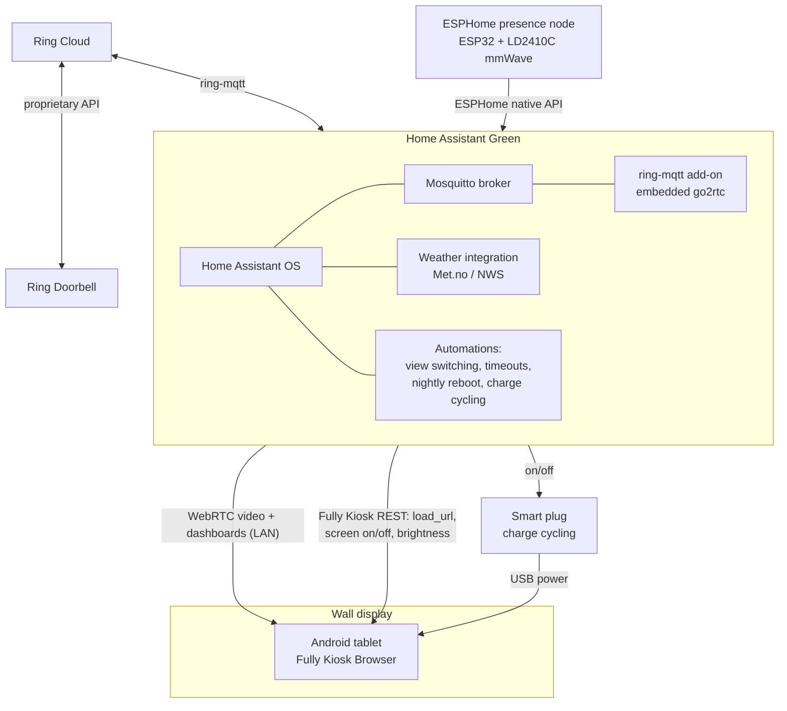
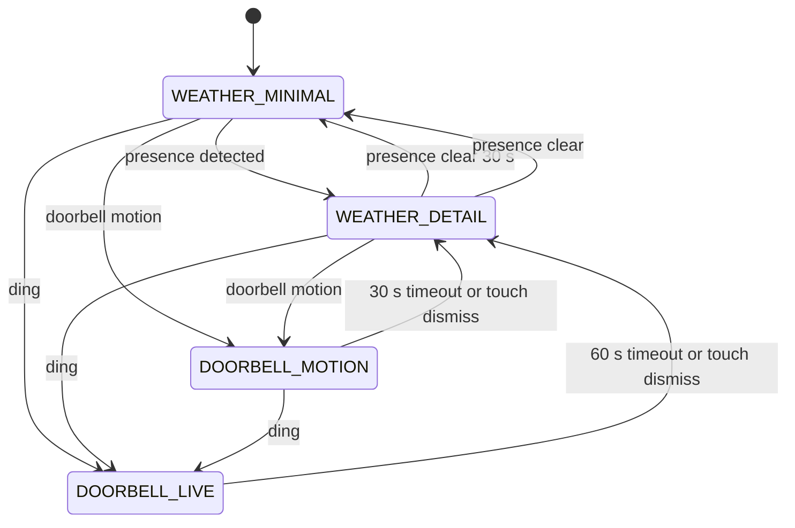

# PRD: Doorbell & Weather Wall Display

| | |
|---|---|
| **Client** | Private residence (Konnected/EyezOn alarm — see [Open Questions](#10-open-questions-for-the-client)) |
| **Author** | Chris Dower |
| **Date** | July 2026 |
| **Status** | Draft for client review |
| **Companion docs** | [`BOM.md`](BOM.md) (bill of materials), [`presence-node.yaml`](../presence-node.yaml) (ESPHome presence sensor) |

---

## 1. Summary & Goal

A wall-mounted display near the entryway that:

1. Shows **live video from the client's Ring doorbell** when someone rings the bell or triggers its motion detection.
2. Otherwise shows **weather**, in two modes:
   - **Minimal** — nobody is near the display: a large, glanceable current outdoor temperature.
   - **Detailed** — someone approaches the display: current conditions, high/low, precipitation, hourly outlook, and a clock.

All processing is local except the unavoidable Ring cloud dependency. The system must be remotely updatable without touching the device on the wall.

**Recommended architecture: an Android tablet running Fully Kiosk Browser, driven by a Home Assistant hub.** A fully custom ESP32-P4 build is documented as an alternate in [§7](#7-alternate-build-esp32-p4-custom-display). Both share the same backend, and both use the same ESPHome mmWave presence node.

Why the tablet is recommended: Ring video is H.264, and a tablet has true hardware video decoding — it plays the stream at a smooth ~30 fps with ~1–2 s latency using only built-in Home Assistant features (WebRTC via go2rtc, bundled since HA 2024.11). No firmware is written at all; the display simply renders server-side dashboards, so every future change is a server-side edit. The ESP32 route, by contrast, cannot hardware-decode H.264 on any current Espressif chip (see §7) and tops out at a ~10–15 fps transcoded stream after substantial custom firmware work.

## 2. Users & Context

- Household members glance at the display from across the room (minimal view must be readable at 3–5 m).
- On approach (~1–2 m), the display switches to the detailed weather view; interaction beyond that is optional touch.
- When the doorbell rings, whoever is home wants to see who is at the door **within a few seconds**, without touching anything.
- The client interacts with their alarm via the EyezOn portal today; the alarm is **out of scope** for this phase but the architecture leaves a clean integration path ([§9](#9-out-of-scope)).

## 3. System Architecture



Key architectural facts:

- **Ring has no local video API.** All video transits Ring's cloud. The `ring-mqtt` add-on maintains the cloud session and exposes a local RTSP restream via its embedded go2rtc; Home Assistant's dashboard camera card then delivers it to the tablet over WebRTC. Video is passed through as H.264 without transcoding — negligible hub CPU.
- **Live view requires no Ring subscription.** Only recorded-event playback does.
- **The tablet renders, the hub decides.** All state-machine logic lives in Home Assistant automations. The tablet is a dumb kiosk pointed at dashboards; Home Assistant pushes view changes via the Fully Kiosk integration (`load_url`, screen on/off, brightness).
- **Presence is sensed by a dedicated mmWave node** ([`presence-node.yaml`](../presence-node.yaml)), not the tablet camera. Tablet camera motion detection is widely documented as unreliable (light-change false triggers, poor low-light performance). The LD2410C detects micro-motion at up to ~5 m and reports distance, enabling approach-based switching.

## 4. Functional Requirements

### 4.1 Display state machine



| ID | Requirement |
|---|---|
| FR-1 | On **doorbell ding**, the display switches to a full-screen live camera view within 1 s and turns the screen on if off. A new ding restarts the timer. |
| FR-2 | On **doorbell motion**, same behavior with a shorter timeout. Motion does **not** extend an active camera session (see constraint C-2). |
| FR-3 | Priority: **ding > doorbell motion > presence detail > idle minimal**. |
| FR-4 | Camera view auto-reverts after its timeout (defaults: ding **60 s**, motion **30 s**) or on touch dismiss. |
| FR-5 | **Presence within the sensor zone** switches weather from minimal to detailed within 2 s of approach. |
| FR-6 | **Presence clear for 30 s** reverts to the minimal view. |
| FR-7 | Minimal view: current outdoor temperature, readable at 3–5 m (≥ 120 pt equivalent), plus a small condition icon. |
| FR-8 | Detailed view: current temp + condition, today's high/low, precipitation probability, short hourly outlook, clock. |
| FR-9 | All timeouts are named constants in the automation config, changeable without touching the tablet. |
| FR-10 | Night behavior (screen off overnight, dimming curve) — **open question OQ-7**; the hardware supports all options via `fully_kiosk` brightness/screen services. |

### 4.2 Ring-imposed constraints (design must respect these)

| ID | Constraint | Design response |
|---|---|---|
| C-1 | Ring terminates live streams at **~10 minutes** | Camera views are time-bounded (60 s/30 s), never left on |
| C-2 | Ring **suppresses motion notifications while a live stream is active** | Motion cannot extend a session; only a ding (which always arrives) restarts the timer |
| C-3 | Stream cold-start is **~3–6 s** (on-demand cloud session + WebRTC negotiation) | Set expectation with client; acceptance test AT-4 measures it |
| C-4 | Battery-powered Ring doorbells drain/overheat under frequent streaming | OQ-1 (doorbell model); if battery-powered, motion-triggered streaming may need to be disabled |
| C-5 | ring-mqtt supports **H.264 only**; Ring is enabling HEVC/H.265 on newer cameras with no H.264 fallback | **Critical dependency** — verify the client's doorbell model before purchase (OQ-1) |

## 5. Dashboards (tablet UI)

Three Home Assistant Lovelace views on a dedicated dashboard, with the `kiosk-mode` HACS plugin hiding the HA header/sidebar:

1. **`/minimal`** — single large temperature stat + condition icon. Dark background (screen-off is the primary burn-in mitigation; this view is the fallback ambient state).
2. **`/detail`** — weather panel: current conditions, high/low, precipitation, hourly forecast strip, clock.
3. **`/doorbell`** — full-screen live camera card (WebRTC), "LIVE" badge, tap anywhere = dismiss (navigates back).

Forecast data note: since HA 2024.4, forecasts are only available via the `weather.get_forecasts` action — the detailed view is fed by **template sensors** (high, low, precipitation, hourly summary) created during hub setup. This is a hard setup dependency, not optional.

## 6. Non-Functional Requirements

| ID | Requirement |
|---|---|
| NFR-1 | Ding → camera page visible: ≤ 1 s. Ding → first video frame: ≤ 6 s cold start, ~2 s warm (bench-measure at acceptance; no published end-to-end figure exists for this exact chain). |
| NFR-2 | Steady-state video latency ~1–2 s, ≥ 24 fps (hardware H.264 decode via WebRTC). |
| NFR-3 | **Remote updatability:** all UI and behavior changes are server-side (dashboards + automations). The presence node updates over ESPHome OTA. No wall-device disassembly for any software change. |
| NFR-4 | **Reliability automations (standard practice for wall tablets):** nightly Fully Kiosk browser restart; battery charge-cycling via smart plug (charge below ~40%, stop above ~80%) to delay battery swelling; disable Android MAC randomization on the tablet's Wi-Fi (breaks the IP-based Fully integration). |
| NFR-5 | Screen off when no presence for a configurable period (also the burn-in mitigation). Wake on presence or doorbell event. |
| NFR-6 | Privacy: all components local except Ring's cloud (unavoidable) and Met.no/NWS weather polling. No additional cloud accounts. |
| NFR-7 | Graceful degradation: if the stream fails, the camera view shows the card's error state and auto-reverts on timeout; weather views function with stale data and show a "last updated" indicator. |

## 7. Alternate build: ESP32-P4 custom display

Documented for completeness; **not recommended as primary** for this client. Choose it only if the instant-boot/no-battery/fully-custom-enclosure properties outweigh video quality and engineering cost.

**Reality check on ESP32 video (verified against Espressif's own documentation, July 2026):** no shipping Espressif chip has a hardware H.264 *decoder*. The ESP32-P4's H.264 hardware is **encode-only**; third-party "4K30 decode" spec sheets are wrong. Software decode (tinyH264) manages ~10 fps at 720p / ~25–31 fps at 640×480, constrained-baseline only. The P4's hardware decoder is **JPEG** (1080p @ 30 fps).

**Consequently the viable P4 video path is MJPEG:** go2rtc on the hub transcodes the Ring H.264 stream to MJPEG (`ffmpeg:<cam>#video=mjpeg`, capped width/fps — this transcode *does* cost hub CPU, only while a session is active), and the P4 plays the HTTP MJPEG stream using its hardware JPEG decoder at **~10–15 fps**.

| | Hardware | Firmware |
|---|---|---|
| **Board** | Guition JC1060P470 — 7" 1024×600 MIPI-DSI touch, ESP32-P4 (32 MB PSRAM) + ESP32-C6 Wi-Fi, $34–42. 10.1" alt: Guition JC8012P4A1, $52–75. | ESPHome (P4 supported since 2025.6; `mipi_dsi` driver covers this panel's JD9165 controller) |
| **Phase 1** | Same board | Stock ESPHome: LVGL weather pages + `online_image` JPEG snapshot polling (~1 fps "animated snapshots"). Pure YAML, OTA included. |
| **Phase 2** | Same board (OTA upgrade) | Custom C++ external component: HTTP MJPEG client → hardware JPEG decode → display, ~10–15 fps. **No prior art exists — this is novel firmware development (order of weeks), and you own every bug.** |

Trade-off vs tablet: boots in ~2 s (vs 30–60 s), no battery to swell, no Android maintenance, cheapest hardware, fully custom enclosure — but video is markedly worse, every UI change is a firmware build + OTA, and ESPHome's P4 display/Wi-Fi support, while progressing fast, is still maturing.

The **presence node, hub, and all backend setup are identical** in both builds, so the client can switch later without redoing the backend.

A middle option exists between the two: a **PoE Android in-wall panel** (batteryless, auto-boots after power loss, flush 86-box mount, Ethernet) runs the exact same tablet software stack while eliminating the consumer tablet's three main failure modes. See BOM Table C; pricing and vendor vetting required.

## 8. Dependencies & Setup Order

1. **Home Assistant Green** — initial setup, static IP/DHCP reservation.
2. **Mosquitto broker** add-on.
3. **ring-mqtt** add-on — authenticate to the client's Ring account; cameras appear via MQTT discovery with ding/motion event entities and the live camera stream.
4. **Weather** — Met.no (default, no key) or NWS (US, free; OQ-6). Create **forecast template sensors** via `weather.get_forecasts` (required by §5).
5. **Presence node** — flash [`presence-node.yaml`](../presence-node.yaml), mount near the display, tune LD2410 gates to the approach zone.
6. **Tablet** — install Fully Kiosk Browser + PLUS license ($9 one-time); configure kiosk URL, remote admin, screen/motion settings; disable MAC randomization; add the `fully_kiosk` integration in HA.
7. **Dashboards** — three views (§5) + `kiosk-mode` HACS plugin.
8. **Automations** — ding/motion/presence/timeout view switching, nightly restart, charge cycling (Appendix A).

## 9. Out of Scope (this phase)

- **Alarm status/control on the display.** Discovery blocker: *Konnected* (a panel replacement that runs ESPHome firmware) and *EyezOn* (the cloud portal for EnvisaLink boards that attach to DSC/Honeywell panels) are mutually exclusive products — the client's description contradicts itself (OQ-3). Either way, Home Assistant has a native local integration (`konnected` / `envisalink`), so an alarm dashboard page is a clean later phase once the actual hardware is identified.
- Two-way audio to the doorbell.
- Recorded-event playback (requires a Ring subscription).
- Additional cameras (architecture supports them; per-camera dashboards would be added).

## 10. Open Questions for the Client

| ID | Question | Why it matters |
|---|---|---|
| OQ-1 | **Exact Ring doorbell model** (and wired vs battery) | HEVC-only newer models break ring-mqtt entirely (C-5); battery models limit streaming (C-4). **Answer before ordering anything.** |
| OQ-2 | Ring subscription status | Live view works without one; sets expectations for event playback |
| OQ-3 | **Photo of the alarm panel** (inside the enclosure) | Resolves the Konnected-vs-EnvisaLink contradiction; determines the future alarm integration path |
| OQ-4 | Tablet preference: Fire HD 10 (cheapest, Amazon ads/sideload caveats) vs Galaxy Tab A9+ (cleaner, longer security support) | BOM Table A choice |
| OQ-5 | Mount aesthetics: surface mount (visible tablet + cable) vs budget for a flush PoE in-wall panel | Table A vs Table C upgrade row |
| OQ-6 | Is the property in the US? | NWS eligibility (otherwise Met.no) |
| OQ-7 | Night behavior: screen fully off overnight, dim ambient temp, or presence-wake only? | FR-10 automation config |
| OQ-8 | Wi-Fi credentials & SSID coverage at the mount location are assumed good (power + Wi-Fi confirmed present) — confirm 2.4 GHz is available for the presence node | ESP32 is 2.4 GHz-only |

## 11. Acceptance Tests

| ID | Test | Pass criteria |
|---|---|---|
| AT-1 | Presence node bench test | Approach → `presence` on ≤ 2 s; walk away → off in 30–35 s; distance sensor tracks within ±0.5 m |
| AT-2 | Dashboard switching | Presence on → detail view ≤ 2 s; presence clear → minimal view at 30–35 s |
| AT-3 | Weather data | Detail view shows current temp, high/low, precipitation, hourly; survives HA restart |
| AT-4 | **Ding-to-video** | Press doorbell: camera page ≤ 1 s, first frame ≤ 6 s (cold), ≥ 24 fps sustained for 60 s, measured latency recorded |
| AT-5 | Timeout & dismiss | Auto-revert at 60 s (ding) / 30 s (motion); touch dismisses immediately; new ding during session restarts timer |
| AT-6 | Failure drills | Stop ring-mqtt mid-stream → error state + auto-revert; reboot HA → tablet recovers without touch; kill tablet Wi-Fi 60 s → recovers |
| AT-7 | Power-loss drill | Document tablet behavior on outage/restore (manual power-on expected — client informed); presence node and hub auto-recover |
| AT-8 | 72 h soak | No manual intervention needed; nightly restart automation fired; charge cycling kept battery in 40–80% band |

## Appendix A — Reference automation sketches (HA YAML)

> Illustrative, to be finalized during setup. Entity IDs follow ring-mqtt/ESPHome discovery defaults.

```yaml
# Ding → full-screen camera, timed revert
- alias: "Doorbell ding: show camera"
  triggers:
    - trigger: state
      entity_id: event.front_door_ding
  actions:
    - action: fully_kiosk.load_url
      data:
        device_id: !input tablet
        url: "http://homeassistant.local:8123/wall-display/doorbell"
    - action: switch.turn_on
      target: {entity_id: switch.tablet_screen}
    - delay: "00:01:00"          # ding_timeout
    - action: fully_kiosk.load_url
      data:
        device_id: !input tablet
        url: "http://homeassistant.local:8123/wall-display/detail"
  mode: restart                   # new ding restarts the timer

# Presence → detail vs minimal
- alias: "Wall display: presence view switch"
  triggers:
    - trigger: state
      entity_id: binary_sensor.wall_presence_occupancy
  conditions:
    - condition: state            # never fight an active doorbell session
      entity_id: input_boolean.doorbell_session
      state: "off"
  actions:
    - choose:
        - conditions: [{condition: state, entity_id: binary_sensor.wall_presence_occupancy, state: "on"}]
          sequence:
            - action: fully_kiosk.load_url
              data: {url: "http://homeassistant.local:8123/wall-display/detail"}
      default:
        - action: fully_kiosk.load_url
          data: {url: "http://homeassistant.local:8123/wall-display/minimal"}

# Nightly reliability restart (standard wall-tablet practice)
- alias: "Tablet: nightly browser restart"
  triggers: [{trigger: time, at: "03:30:00"}]
  actions: [{action: fully_kiosk.restart_browser, data: {device_id: !input tablet}}]

# Battery charge cycling (swelling mitigation)
- alias: "Tablet: charge cycling"
  triggers:
    - trigger: numeric_state
      entity_id: sensor.tablet_battery
      below: 40
      id: low
    - trigger: numeric_state
      entity_id: sensor.tablet_battery
      above: 80
      id: high
  actions:
    - choose:
        - conditions: [{condition: trigger, id: low}]
          sequence: [{action: switch.turn_on, target: {entity_id: switch.tablet_charger}}]
        - conditions: [{condition: trigger, id: high}]
          sequence: [{action: switch.turn_off, target: {entity_id: switch.tablet_charger}}]
```

## Appendix B — References

- ring-mqtt: <https://github.com/tsightler/ring-mqtt> (video streaming wiki documents the constraints in §4.2)
- Fully Kiosk Browser + HA integration: <https://www.home-assistant.io/integrations/fully_kiosk/>
- go2rtc in HA (WebRTC): <https://www.home-assistant.io/integrations/go2rtc/>
- kiosk-mode plugin: <https://github.com/maykar/kiosk-mode>
- LD2410 in ESPHome: <https://esphome.io/components/sensor/ld2410/>
- ESP32-P4 codec reality (alternate build): <https://github.com/espressif/esp-h264-component> — HW encoder only; SW decode perf table
- Guition JC1060P470 community configs: <https://github.com/cheops/JC1060P470C_I_W>
- HA Envisalink integration (future alarm phase): <https://www.home-assistant.io/integrations/envisalink/>
- Konnected ESPHome firmware (future alarm phase): <https://github.com/konnected-io/konnected-esphome>
